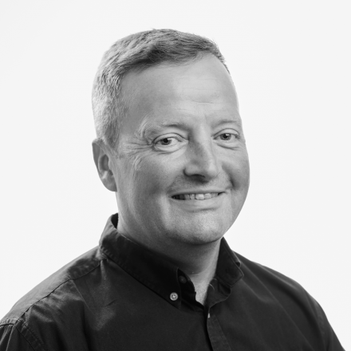

I work with organisations that are striving for social justice and positive change, helping them develop and sustain a clear sense of purpose, strong values and creative environments – all of which are key to sustainable growth and making a lasting impact.

Colleagues describe me as bringing an analytical approach, delivered with clarity, warmth and humour. My approach is not to just leave a report on your desk but to work with you through the ups and downs of change.

As Executive Director of Change Grow Live for over 20 years I was responsible for new business and mergers and acquisitions that saw turnover increase from £1m – £200m+, all whilst maintaining a high-performance culture in a highly regulated, rapidly growing national organisation.

My experience included leading people functions and overseeing the organisation’s recent values, brand and positioning refresh, resulting in a more authentic and effective communications strategy.

I have significant Board level experience within CGL and as Chair of Brighton and Hove Community Works, The Trust for developing Communities and Vice-Chair of Unlock.

